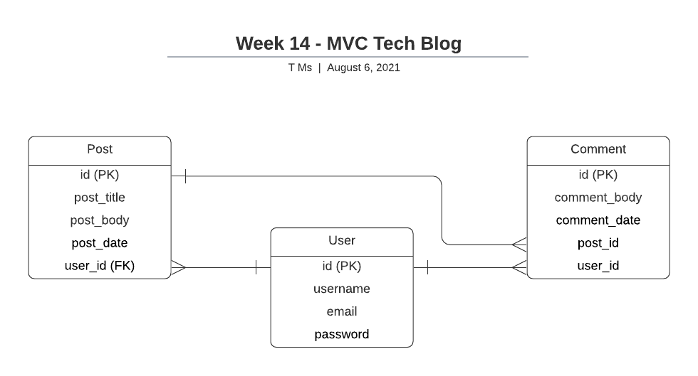
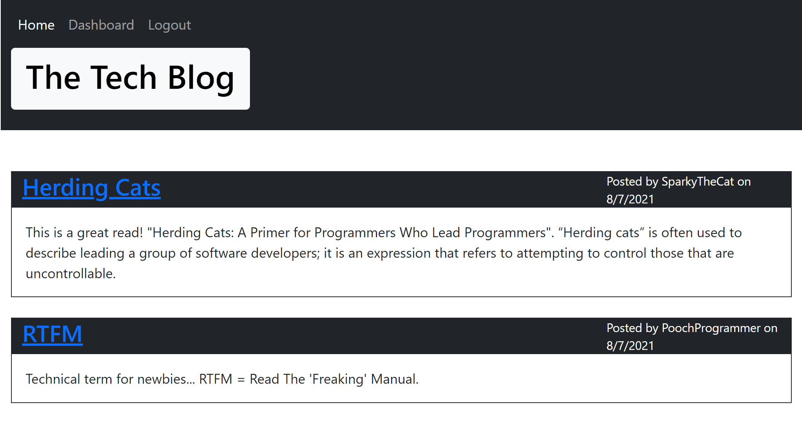
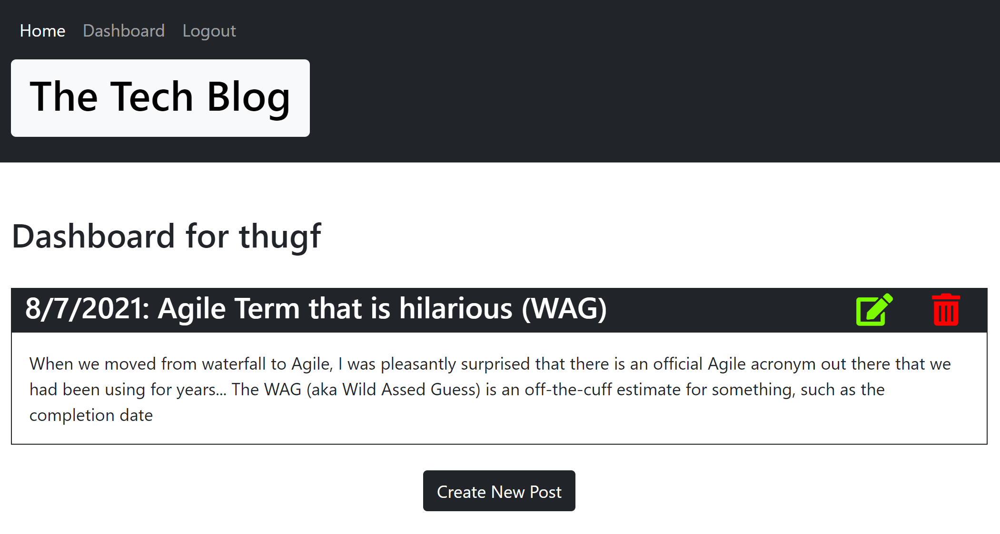

# Week14-MVC Tech Blog

## Description

- This is a CMS style blog site where developers can publish their blog posts and comment on other developer's posts.
- Site is deployed on Heroku.
- Site follows MVC paradigm in its architectural structure.
- Technologies used are: Express.js, Handlebars, Sequelize, Express-session, MySQL, BCrypt.

## Link to App

https://fathomless-sea-78946.herokuapp.com/

## Requirements

- Visitors can view blog posts on entry to the website.  Any other action requires either signup or login.
- Once logged in, the navbar presents a logout link.
- On the homepage, posts are displayed with title, body, date created, and username of poster.
- From the homepage comments are displayed with date created, and username of poster.  A button to add a comment is available.
- From the dashboard the logged in user's posts are displayed with an option to add new posts, delete posts, or the ability to edit posts.

## Database design

## Screens

---